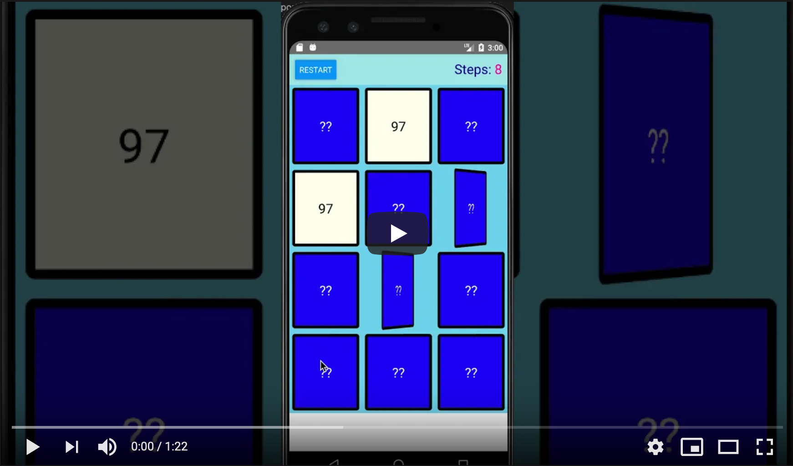

# Mobile App Assignment - Card Game

## Getting Started
Inside the [memorygame](memorygame) folder,  run `yarn install`, once it finished, you can run `yarn android` to run the application on Android.
For convenience, a copy of the [apk](docs/app-release.apk) has been provided.

## Memory Game
This game test your memory power (and luck!) by measuring how many steps do you need to reveal all pairs of numbers in the board. To reveal a pair, click on any closed card to reveal the first number then click on another closed card to reveal the second number, if both numbers matched the pair of cards will remain revealed and you can move on to hunt another pair, if they ain't matched, both will get closed in a sec. Each time you open a card will be counted as a step so try to win the game with the least steps!

## Demo
The UI has been designed to be responsive. The board and the card will resize automatically to fill the screen.
The number of ROW and COL on the board is also configurable from the env-var upon building the app, along with the MIN (inclusive) and MAX (exclusive) numbers that may appear randomly on the cards
I am not sure about the usage for a single CARD_PAIRS_VALUE, the above 4 vars should satisfy the same requirement but if it didn't it should be fairly simple to adapt

### As seen on various screen sizes

## Feature Checklists
### Requirements
- [ ] Using constant 'CARD_PAIRS_VALUE' to define and generate pairs of numbers(from 1 to 100) and assign to different cards with random order when app launch
- [X] Card default states is back side up, the cards will turn to front side with animation when player tap it
- [X] If player flop two cards with different number, these 2 card will flip to back side after 1 seconds
- [X] If player flop two cards with same number, these two cards will make as resolved (flop other cards won't affect them)
- [X] When player resolve all the cards, app will show congratulation prompt as demo, after prompt dismiss will restart the game
- [X] Need to record how many steps player has tried as shows as demo
- [X] When play tap 'Restart' button, all the card need to be regenerated and steps counter also reset to 0
- [X] Compatible with different screen size
- [X] Unit test case for key feature codes.
- [X] Once complete publish your code to github, bitbucket or other git based source control. (please make sure we have access)

### Bonus Points
In case to improve our code quality and production quality, we have such practices as:

- [X] Build reuse UI as component
- [X] Code is clean and well structured
- [X] Styling it to a production quality level
- [ ] Unit test case coverage up to 80% with report ([70.64%](memorygame/coverage/lcov-report/index.html) achieved)
- [X] Linting, code quality scan, etc
- [X] For React Native
  - [X] use react-hooks
  - [X] use redux
- [ ] For Android native
  - [ ] use MVVM design
  - [ ] use AndroidX
  - [ ] use Kotlin
- [ ] For iOS native
   - [ ] use MVVM design
   - [ ] build UI programmatically

It's up to you to decide how far you want to go, time permitting.
